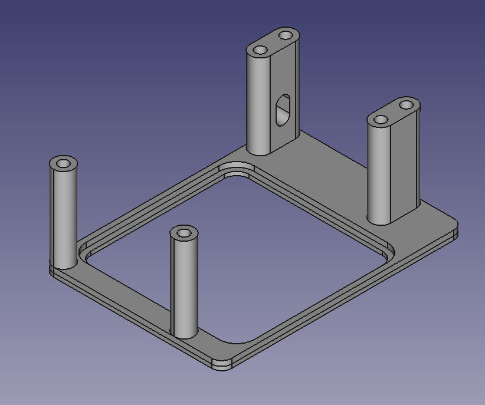
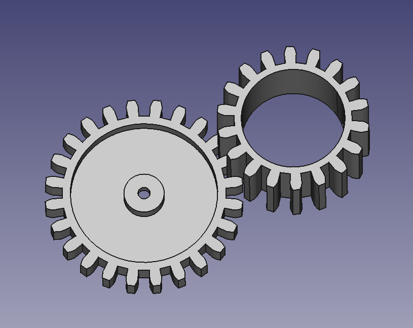
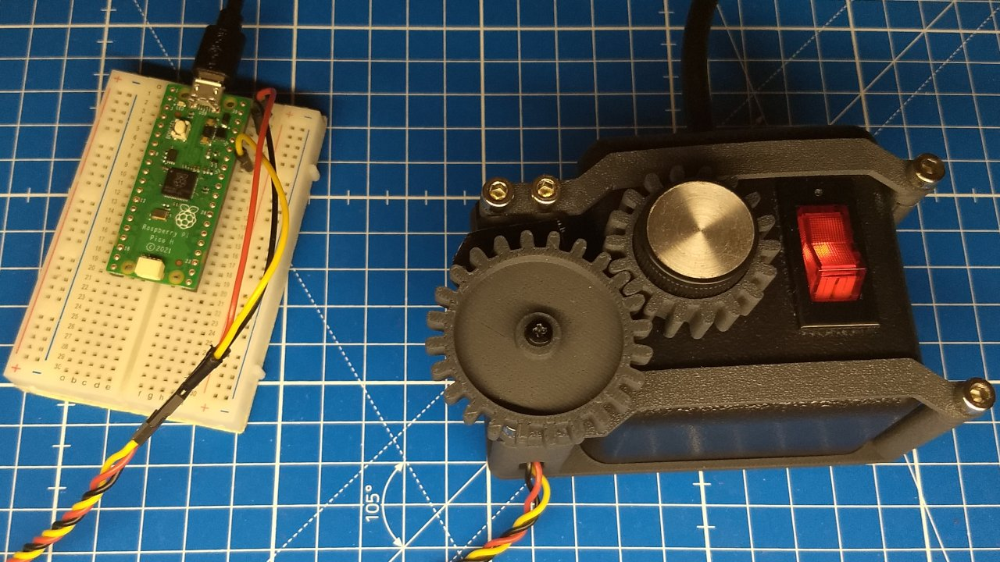

# buttplug.io Venus Controller

The [Venus for Men](https://venusformen.com/) by Sybian is one of the most expensive sex toys on the market.
 
This project allows you to control the Venus via the [buttplug.io protocol](https://docs.buttplug.io/docs/spec/) **without changing, hacking or breaking the toy's electronics**.

It is geared towards the [Lustbound](https://www.lustboundgame.com/) game in particular.

### Assembly

* Microcontroller: Compile the code in the `controller` director and flash it on a microcontroller of your choice. I had a [Raspberry Pi Pico](https://www.raspberrypi.com/products/raspberry-pi-pico/) at hand, but you can probably use any microcontroller. The provided code makes use of [platformio](https://platformio.org/) and uses the Arduino framework, that should be the de-facto common ground. Wire the servo to whatever output pin you chose (I chose pin 34 for GP28 because that is close to GND and VBUS).

* Servo: I had a [MG996R](https://www.digikey.com/en/htmldatasheets/production/5014637/0/0/1/mg996r) at hand, so I used that.

* Frame: You need a 3D printer to print the controller frame (base and brackets) as well as the gears.

    
    

    Screw the gear onto the servo. Turn the control knob into the "off" position and carefully turn the servo into the opposite direction (because of the gears). Now stick the other gear over the control knom. This is what the end result should look like:

    
    
    Disconnect the servo from the microcontroller (some models allegedly back-feed). Check mobility by carefully turning the servo all the way in both directions. If the servo blocks, but the knob still has some wriggle room in both directions, you did it right. Now connect the servo to the controller again.

    These models have been prepared for a Bambulab X1C with PLA-CF. Adjustments might be necessary (especially fitting the control knob). You can use [FreeCAD](https://www.freecad.org) to adjust the provided files. It is free.

### Usage

Have [websockets](https://pypi.org/project/websockets/) installed in your python environment.

Execute `lustbound.py`. The servo will turn the knob in the "off" position. If this breaks the gear, the knob or the servo, you installed it the wrong way around and must admit defeat.

Start Lustbound.

### Developer Notes

Lustbound uses the deprecated version 2 of the protocol, making use of the old [VibrateCmd](https://docs.buttplug.io/docs/spec/deprecated/#vibratecmd) instead of the current [ScalarCmd](https://docs.buttplug.io/docs/spec/generic#scalarcmd).

